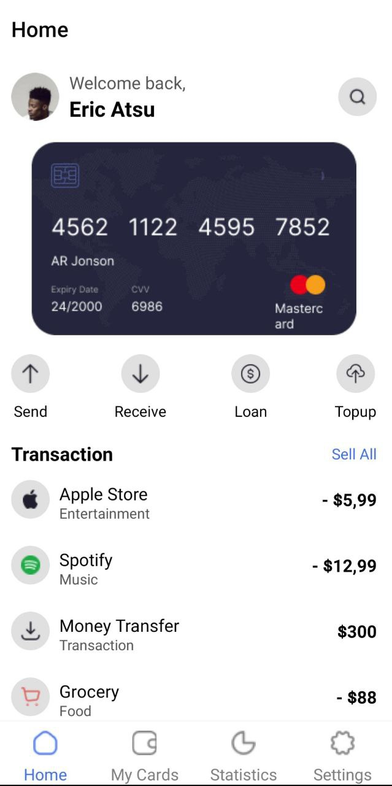

# React Assignment 5

## Student ID: 11263775

## Description:
For this assignment we were asked to create a mobile application duplicating the UI design example given. The application involves bottom tab navigation,and also allows users to switch between light and dark themes.

### How the application was built:
-The project was bootstrapped using expo init to create a new React Native application.
Some examples of the dependencies that were installed are @react-navigation/native, @react-navigation/bottom-tabs, and react-native-gesture-handler among others.

-For the bottom tab navigation, it was implemented using createBottomTabNavigator from @react-navigation/bottom-tabs.
Four main screens, Home, Statistics, Card, and Settings, were added to the tab navigator.

-For theme switching, a context provider, themecontext, was created to manage light and dark themes.
The Settings screen includes a switch to toggle between themes.
 

### Home Screen:
The Home screen welcomes the user and provides a quick overview of their profile.
Users are able to view their card information and transactions they have made on various apps.
The home screen was added to the tab navigator.

### My Cards: 
This screen displays user card info.
The card displays detailed information such as card number, expiry date, and other relevant data.

### Statistics:
The Statistics screen provides detailed insights and analytics related to the user's activities. These are the user transactions and transaction statistics as seen on thr screens.

### Settings:
The Settings screen allows the user to customize their app preferences,including theme switching. 
Users also have options to change language, update user info, change password etc.
The settings screen was also added to the bottom tab navigation.

### Theme Switch:

